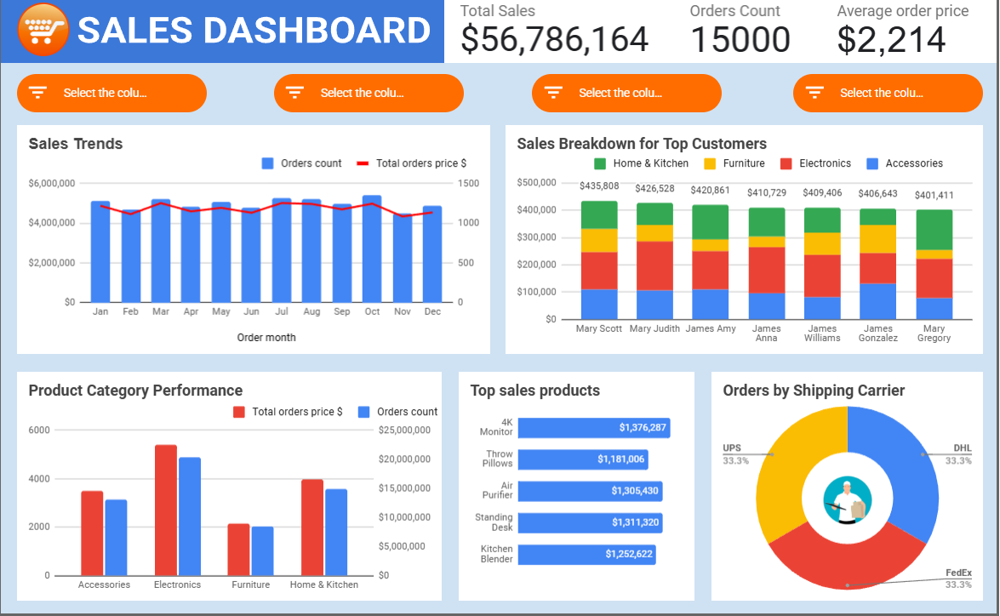

# 📊 Google Sheets Sales Data Analysis

## 📋 Overview
This project demonstrates a **sales data analysis** conducted in **Google Sheets**, from raw data processing to the creation of an interactive sales dashboard.  

The analysis includes:
- Consolidation of raw sales data into a single master table  
- Use of **pivot tables** and **charts** to explore trends and key metrics  
- Development of a **dynamic, interactive dashboard** with filtering options  

The dashboard visualizes sales trends, category performance, top customers, top products, and shipping carrier distribution.  

---

## 🖼 Dashboard Preview

---

## 🛠 Data Processing Steps
1. **Data Collection & Cleaning**  
   - Merged raw sales data from multiple sources into a unified table  
   - Standardized date, product, category, and pricing formats  

2. **Meta-Analysis**  
   - Summarizes the **data sources** used, along with **data profiling** results before and after cleaning  

3. **Dashboard Construction**  
   - Integrated charts and KPI cards for quick insights  
   - Added filters for interactive analysis (by column selection)  

---

## 📈 Dashboard Features
- **KPI Cards**:  
  - **Total Sales:** $56,786,164  
  - **Orders Count:** 15,000  
  - **Average Order Price:** $2,214  
- **Sales Trends**: Monthly total sales and order count comparison  
- **Top Customers**: Sales breakdown by product category for top customers  
- **Product Category Performance**: Orders and sales value per category  
- **Top Sales Products**: Best-performing items by revenue  
- **Orders by Shipping Carrier**: Share of orders across UPS, DHL, and FedEx  

---

## ✅ Conclusions

1. **Overall Sales Performance**  
   - The company achieved **over $56M in sales** from 15,000 orders.  
   - The **average order value** is **$2,214**, indicating a focus on medium- to high-value items.  

2. **Monthly Trends**  
   - Sales are relatively stable throughout the year, with slight peaks in **February, March, and October**.  
   - Order counts follow a similar trend, suggesting steady demand without significant seasonal fluctuations.  

3. **Top Customers**  
   - **Mary Scott**, **Mary Judith**, and **James Amy** generate the highest revenues, each exceeding **$420K**.  
   - Electronics and Home & Kitchen are major contributors to their purchase volumes.  

4. **Category Performance**  
   - **Electronics** lead both in total sales value and number of orders.  
   - **Home & Kitchen** ranks second in revenue, followed by **Accessories**.  
   - **Furniture** is the least performing category in terms of sales and orders.  

5. **Best-Selling Products**  
   - **4K Monitor** is the top product with $1.38M in sales, followed closely by **Throw Pillows** and **Air Purifier**.  
   - The mix of electronics and home goods in the top list suggests diverse customer demand.  

6. **Shipping Carriers**  
   - UPS, DHL, and FedEx each handle approximately **one-third** of all orders, indicating balanced distribution among carriers.  

---

## 🧰 Tools Used
- **Google Sheets**: Data processing, pivot tables, chart creation, dashboard design  
- **Google Sheets Filters**: Interactive elements for data exploration

---

## 📌 How to Run
1. Open the provided [Google Sheets file]().
2. Navigate to the dashboard tab for interactive analysis.  
3. Use filter selectors to explore specific product categories, customers, or date ranges.  
